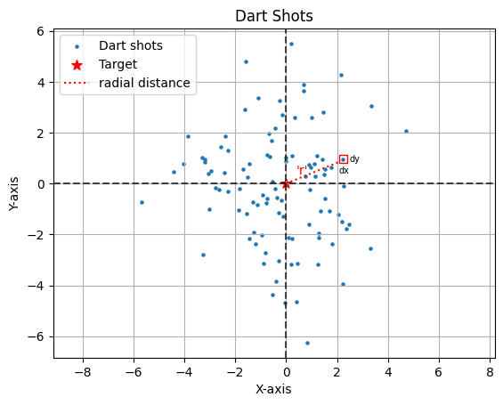

# Normal distribution pdf derivation

Derive:
$$
f(x)=\frac{1}{\sigma \sqrt{2\pi}}\cdot e^{-\frac{1}{2} (\frac{x-\mu}{\sigma})^2}
$$

<div style={{ textAlign: 'justify' }}>

## Dart thought experiment

The dart thought experiment is a conceptual way to understand the derivation of the probability density function (PDF) of a normal distribution, often known as a Gaussian distribution. Here's an explanation of the thought experiment:

1.  **Dartboard Analogy**: Imagine a dartboard where darts are thrown randomly. Assume that the darts are more likely to hit near the center of the board and less likely to hit as you move away from the center. This setup is analogous to a random variable with a normal distribution, where values near the mean are more likely than values far from the mean.
    
2.  **Two-Dimensional Distribution**: The dartboard as a two-dimensional space with the center representing the mean of the distribution. The x and y coordinates of where the dart hits can be thought of as two independent normally distributed random variables, each with its own mean and standard deviation.
    
3.  **Radial Symmetry and Distance**: The probability of a dart landing at a particular point should only depend on the distance of that point from the center, not the direction. This radial symmetry suggests that the probability density at any point depends only on the distance from the mean, not the specific x and y values.

</div>

## Simulation


```python
import numpy as np
from scipy.integrate import quad
import matplotlib.pyplot as plt
import matplotlib.patches as patches
```


```python
np.random.seed(2609)
shots=np.random.normal(0,2,(100,2))

plt.axhline(y=0, color='black', linestyle='--',alpha=0.7)
plt.axvline(x=0, color='black', linestyle='--',alpha=0.7)

plt.scatter(shots[:,0],shots[:,1],s=5,label='Dart shots')
plt.scatter(0,0,marker='*', color='r',s=70,label='Target')
plt.plot([0,2.15], [0, 0.88], linestyle=':', color='red',label='radial distance')


# Arguments: (x, y) lower left corner, width, height
square = patches.Rectangle((2.10, 0.83), 0.3, 0.3, fill=False, color='red')  # A small square

# Get current axis and add patch
plt.gca().add_patch(square)

plt.annotate('dx',xy=(2.07, 0.4),xytext=(2.07, 0.4),fontsize=7)
plt.annotate('dy',xy=(2.5, 0.85),xytext=(2.5, 0.85),fontsize=7)
plt.annotate("'r'",xy=(2.5, 0.85),xytext=(0.4, 0.35),color='r',fontsize=10)


plt.xlabel('X-axis')
plt.ylabel('Y-axis')
plt.title('Dart Shots')

plt.axis('equal')
plt.legend(loc='upper left')
plt.grid()
plt.show()
```


    

    


## Derivation of probability density function

### Main: Part 1 

Consider a function $\phi$ which takes $x$ and $y$ coordinates and spits out the probability that the Dart shot would be in the area $dA=dx.dy$.

$\phi: \mathbb{R}\times \mathbb{R} \rightarrow [0,1] \equiv \phi: r \rightarrow [0,1]$, where $r$ is the polar coordinate.

$$
\int_{S}\phi(r)\cdot dA = \int_{-\infty}^{\infty} \int_{-\infty}^{\infty} \phi(r)\cdot dx \cdot dy = 1
$$

Since $x$ and $y$ are independent,

$$
\phi(r)=f_X(x)\cdot f_Y(y),
$$
where $f_X(x)$ and $f_Y(y)$ are marginal pdfs of $X$ and $Y$.

$r$ is given by $\sqrt{x^2 + y^2}$, hence

$$
\phi(r)=\phi(\sqrt{x^2 + y^2})=f_X(x)\cdot f_Y(y).
$$

Let $y=0$ and $f_Y(0)=\lambda$, then

$$
\begin{align*}
&\phi(\sqrt{x^2 + 0^2})= \phi(x) =f_X(x)\cdot f_Y(0) = f_X(x)\cdot \lambda .\\
&\implies \phi(x) = \lambda \cdot f_X(x)\\
&\implies \phi(\sqrt{x^2 + y^2}) = \lambda \cdot f_X(\sqrt{x^2 + y^2})\\
&\implies \lambda \cdot f_X(\sqrt{x^2 + y^2}) = f_X(x)\cdot f_Y(y)
\end{align*}
$$
Divide the last equation by $\lambda^2$, we get
$$
\begin{align*}
&\implies \frac{f_X(\sqrt{x^2 + y^2})}{\lambda} = \frac{f_X(x)}{\lambda}\cdot \frac{f_Y(y)}{\lambda}.
\end{align*}
$$
Assume that both the random variables, $X$ and $Y$, have same mean and standard deviation.
$\implies f_X(.)=f_Y(.)=f(.)$ and the above equation can be written as,
$$
\begin{align*}
&\implies \frac{f(\sqrt{x^2 + y^2})}{\lambda} = \frac{f(x)}{\lambda}\cdot \frac{f(y)}{\lambda}.
\end{align*}
$$
Let $g(x)=\frac{f(x)}{\lambda}$,
$$
\begin{align*}
&\implies g(\sqrt{x^2 + y^2}) = g(x)\cdot g(y).
\end{align*}
$$

### Aside: Algebra

Consider the following observations:

* $n^x \cdot n^y = n^{(x+y)}$
* $n^{x^2} \cdot n^{y^2} = n^{(x^2+y^2)}$
* Let $g(x)=e^{kx^2}$
$$\implies g(x)\cdot g(y)=e^{kx^2}\cdot e^{ky^2}=e^{k(x^2+y^2)}=g(\sqrt{x^2+y^2})$$

### Main: Part 2

Now we have,
$$
\begin{align*}
&g(x)=e^{kx^2} \text{ and also } g(x) = \frac{f(x)}{\lambda}\\
&\implies f(x) = \lambda \cdot g(x) = \lambda \cdot e^{kx^2}
\end{align*}
$$
*Note:* $k$ has to be negative otherwise $f(x)$ would be an increasing function of $x$ as we have assumed that darts are more likely to hit the center of the board. To ensure $k$ to be negative, we set $k=-m^2, \forall m \in \mathbb{R}$.
$$\implies f(x)=\lambda e^{-m^2x^2}.$$

Since $f(x)$ is a pdf,
$$\int_{-\infty}^{\infty}f(x) \cdot dx = \int_{-\infty}^{\infty}\lambda e^{-m^2x^2} \cdot dx=1$$
Let $u=mx$, $\implies du=mdx$,
$$\int_{-\infty}^{\infty}\lambda e^{-m^2x^2} \cdot dx = \frac{\lambda}{m}\int_{-\infty}^{\infty} e^{-u^2} \cdot du =1$$

### Aside: Tricky integral

Integrate $\int_{-\infty}^{\infty} e^{-u^2} \cdot du$.

We will use two ways to calculate above integral, analytical and numerical.

#### Analytical

Consider
$$I=\int_{-\infty}^{\infty} e^{-u^2} \cdot du,$$
then,
$$I^2=\left(\int_{-\infty}^{\infty} e^{-x^2} \cdot dx\right)\cdot\left(\int_{-\infty}^{\infty} e^{-y^2} \cdot dy\right)$$
In terms of $x$ and $y$, this can be expressed as a double integral over the entire plane:
$$I^2=\int_{-\infty}^{\infty} \int_{-\infty}^{\infty} e^{-(x^2+y^2)} \cdot dx \cdot dy$$
Switch from Cartesian coordinates $(x,y)$ to polar coordinates $(r,\theta)$. In polar coordinates, $x^2+y^2=r^2$ and $dx dy=r dr d\theta$.[[How?]]() 

The limits for $r$ will be from $0$ to $\infty$, and for $\theta$, from $0$ to $2\pi$.
$$\implies I^2=\int_{0}^{2\pi} \int_{0}^{\infty} e^{-r^2} \cdot r \cdot dr \cdot d\theta$$

* Step 1: Calculate $\int_{0}^{\infty} e^{-r^2} \cdot r \cdot dr$
  Substitute $r^2=u$, we get $du=2rdr$ and :
  $$\frac{1}{2}\int_{0}^{\infty} e^{-u} \cdot du =\frac{1}{2}-e^{-u}\Bigr|_{0}^{\infty}=\frac{1}{2}[0-(-1)]=\frac{1}{2}$$
* Step 2: Calculate $I^2=\int_{0}^{2\pi} \frac{1}{2} \cdot d\theta:$
  $$I^2 = \frac{1}{2}\theta\Bigr|_{0}^{2\pi}=\pi $$
  $$\implies I=\sqrt{\pi}$$

#### Numerical


```python
inf = float('inf')
def f(u):
    return (np.e)**(-(u**2))

quad(f, -inf, inf)[0]
```


    1.772453850905516


The above value is equal to $\sqrt{\pi}$.


```python
(np.pi)**(0.5)
```


    1.7724538509055159


### Main: Part 3

We had
$$
\begin{align*}
\int_{-\infty}^{\infty}f(x) \cdot dx&=\int_{-\infty}^{\infty}\lambda e^{-m^2x^2} \cdot dx = \frac{\lambda}{m}\int_{-\infty}^{\infty} e^{-u^2} \cdot du =1 \\
&=\frac{\lambda \sqrt{\pi}}{m} = 1\\
&\implies m^2=\lambda^2 \cdot \pi\\
&\implies k = -\lambda^2 \cdot \pi
\end{align*}
$$
Hence,
$$
f(x)=\lambda e^{-\lambda^2 \pi x^2}.
$$
Now let's talk about variance of $X$:
$$
Var(X)=\sigma^2=\mathbb{E}[(X-\mu_X)^2]=\int_{-\infty}^{\infty}(x-\mu_X)^2f(x)=\int_{-\infty}^{\infty}(x-\mu_X)^2 \lambda e^{-\lambda^2 \pi x^2} \cdot dx
$$
We assumed $\mu_X=0$ since the beginning. Hence,
$$
\sigma^2=\int_{-\infty}^{\infty}x^2 \lambda e^{-\lambda^2 \pi x^2} \cdot dx=\dfrac{1}{2\pi\lambda^2}
$$
This integral is not complicated by has too many steps so I recommend you to use this [solution.](https://www.integral-calculator.com/#expr=%28%28x%29%5E2%20%5Clambda%20e%5E%7B-%5Clambda%5E2%20%5Cpi%20x%5E2%7D%29%20&lbound=minf&ubound=inf)


From the above expression, we get:
$$
\lambda=\frac{1}{\sigma\sqrt{2\pi}}
$$
$$
\implies f(x)=\frac{1}{\sigma\sqrt{2\pi}}\cdot e^{-\frac{1}{2}\left(\frac{x}{ \sigma}\right)^2}
$$

If $\mu_X$ is different from zero then in our derivation all $x's$ will be replaced by $x-\mu$ and we will get the following:
$$
f(x)=\frac{1}{\sigma\sqrt{2\pi}}\cdot e^{-\frac{1}{2}\left(\frac{x-\mu}{ \sigma}\right)^2} \qquad \qquad \blacksquare
$$
